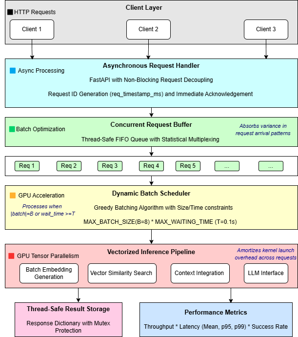
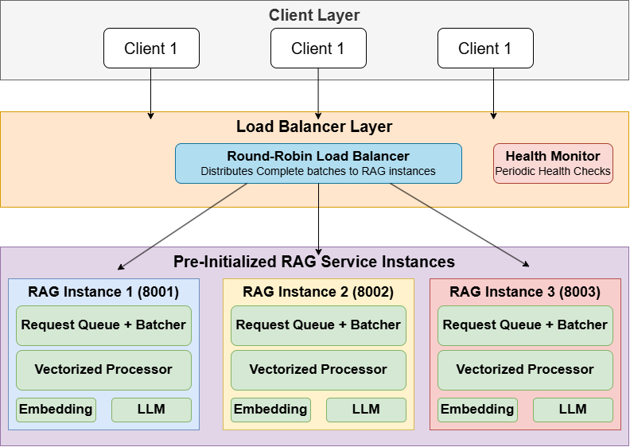

# Task 2: RAG Service Optimization

This directory contains optimized implementations of a Retrieval-Augmented Generation (RAG) service with focus on request handling, batching, and distributed serving.

## Architecture Overview

<div align="center">
  
  <p><em>BatchQueue System with Dynamic Batch Processing</em></p>
</div>
<div align="center">
  
  <p><em>Distributed RAG with Load Balancer & Pre-initialized Instances</em></p>
</div>

The project implements three progressively optimized RAG service architectures:

1. **Baseline** (`baseline/`): Synchronous processing baseline
2. **Optimized** (`optimized/`): Request queuing and batch processing
3. **Distributed** (`distributed/`): Load balancing across multiple instances

## Directory Structure

```
task2_rag_serving/
├── baseline/
│   └── serving_rag_baseline.py          # Basic synchronous implementation
├── optimized/
│   ├── serving_rag_request_queue.py     # Request queue optimization
│   └── serving_rag_batch.py            # Dynamic batch processing
├── distributed/
│   ├── load_balancer.py                 # Round-robin load balancer
│   └── rag_server.py                   # Configurable RAG server instance
└── testing/
    ├── test_script.py                   # Performance testing framework
    └── test_script_LB.py               # Load balancer specific tests
```

## Implementation Details

### Baseline Implementation

**File**: `baseline/serving_rag_baseline.py`

- Synchronous request processing
- Single-threaded RAG pipeline
- Direct request-to-response mapping
- Suitable for low-concurrency scenarios

**Limitations**:
- No request buffering
- Thread pool exhaustion under load
- Linear latency scaling with concurrency

### Request Queue Optimization

**File**: `optimized/serving_rag_request_queue.py`

**Key Features**:
- Asynchronous request handling
- Thread-safe request queue
- Background worker thread
- Non-blocking client interactions

**Benefits**:
- Decouples client connections from processing
- Prevents FastAPI thread pool exhaustion
- Statistical multiplexing of traffic

### Batch Processing Optimization

**File**: `optimized/serving_rag_batch.py`

**Key Features**:
- Dynamic batch formation
- Vectorized embedding generation
- Hybrid time/size-based batching policy
- Configurable batch parameters

**Configuration**:
```python
MAX_BATCH_SIZE = 8        # Maximum requests per batch
MAX_WAITING_TIME = 0.1    # Maximum wait time in seconds
```

**Benefits**:
- Improved GPU utilization through batching
- Reduced per-request overhead
- Sub-linear latency scaling

### Load Balancing

**Files**:
- `distributed/load_balancer.py`: Central load balancer
- `distributed/rag_server.py`: Individual server instances

**Features**:
- Round-robin request distribution
- Health monitoring with periodic checks
- Fault-tolerant result retrieval
- Persistent result storage

## Usage Instructions

### 1. Running Baseline Service

```bash
cd baseline
python serving_rag_baseline.py
```

Service will be available at `http://localhost:8000`

**API Endpoints**:
- `POST /rag`: Send query for processing
  ```json
  {"query": "What animals can hover?", "k": 2}
  ```

### 2. Running Optimized Services

**Request Queue**:
```bash
cd optimized
python serving_rag_request_queue.py
```

**Batch Processing**:
```bash
cd optimized
python serving_rag_batch.py
```

**API Endpoints**:
- `POST /rag`: Submit query (returns request_id)
- `GET /result/{request_id}`: Retrieve result

### 3. Running Distributed System

**Start Load Balancer**:
```bash
cd distributed
python load_balancer.py
```

**Start Multiple Servers**:
```bash
# In separate terminals
python rag_server.py --port 8001
python rag_server.py --port 8002
python rag_server.py --port 8003
```

**Load Balancer Endpoints**:
- `GET /query?query=...&k=...`: Submit query through load balancer
- `GET /fetch_result/{request_id}`: Retrieve result
- `GET /health`: Check system health

## Performance Testing

### Basic Performance Testing

```bash
cd testing

# Test baseline implementation
python test_script.py --url http://localhost:8000 --requests 50 --concurrency "1,5,10,20"

# Test optimized implementations
python test_script.py --url http://localhost:8000 --requests 50 --concurrency "1,5,10,20" --optimized

# Test with custom parameters
python test_script.py \
  --url http://localhost:8000 \
  --requests 100 \
  --concurrency "1,5,10,20,50" \
  --timeout 120 \
  --output "custom_test_results"
```

### Load Balancer Testing

```bash
cd testing
python test_script_LB.py --url http://localhost:8000 --requests 100 --concurrency "1,5,10,20"
```

### Test Parameters

- `--url`: Service endpoint URL
- `--requests`: Total number of requests to send
- `--concurrency`: Comma-separated concurrency levels
- `--timeout`: Request timeout in seconds
- `--optimized`: Flag for testing optimized implementations
- `--output`: Base name for output files

## Performance Results

### Throughput Improvements

| Concurrency | Baseline (req/s) | BatchQueue (req/s) | Improvement |
|-------------|------------------|-------------------|-------------|
| 1           | 1.82            | 1.37              | -24.7%      |
| 5           | 2.09            | 2.44              | +16.7%      |
| 10          | 2.09            | 2.58              | +23.4%      |
| 15          | 2.10            | 2.50              | +19.0%      |
| 20          | 2.08            | 2.54              | +22.1%      |

### Latency Improvements

| Concurrency | Baseline (s) | BatchQueue (s) | Reduction |
|-------------|--------------|----------------|-----------|
| 1           | 0.55         | 0.73           | -32.7%    |
| 5           | 2.35         | 1.90           | +19.1%    |
| 10          | 4.68         | 3.25           | +30.6%    |
| 15          | 6.02         | 4.40           | +26.9%    |
| 20          | 9.24         | 5.07           | +45.1%    |

### Key Observations

1. **Low Concurrency**: Baseline performs better due to no batching overhead
2. **High Concurrency**: Batch processing shows significant improvements
3. **Scalability**: BatchQueue maintains sub-linear latency scaling
4. **Reliability**: 100% success rate across all concurrency levels

## Configuration Options

### Batch Processing Parameters

```python
# In serving_rag_batch.py
MAX_BATCH_SIZE = 8        # Adjust based on GPU memory
MAX_WAITING_TIME = 0.1    # Balance latency vs throughput
```

### Load Balancer Configuration

```python
# In load_balancer.py
rag_servers = {
    "http://localhost:8001": "results_server_1.json",
    "http://localhost:8002": "results_server_2.json",
    "http://localhost:8003": "results_server_3.json",
}
```

### Health Check Settings

```python
# Health check interval
await asyncio.sleep(10)  # Check every 10 seconds
```

## Technical Architecture

### BatchQueue System Components

1. **Asynchronous Request Handler**: Immediate request acknowledgment
2. **Thread-Safe Request Buffer**: FIFO queue with atomic operations
3. **Dynamic Batch Scheduler**: Hybrid time/size-based policy
4. **Vectorized Inference Pipeline**: Batched embedding generation

### Request Flow

```
Client Request → Request ID Assignment → Queue Enqueue →
Batch Formation → Vectorized Processing → Result Storage →
Client Polling → Result Retrieval
```

### Memory Management

- Thread-safe result dictionary with mutex locks
- Automatic cleanup to prevent memory leaks
- Explicit GPU memory management with `torch.cuda.empty_cache()`

## Troubleshooting

### Common Issues

1. **GPU Out of Memory**: Reduce `MAX_BATCH_SIZE`
2. **High Latency**: Decrease `MAX_WAITING_TIME`
3. **Load Balancer Failures**: Check server health endpoints
4. **Polling Timeouts**: Increase timeout values in test scripts

### Performance Tuning

1. **Batch Size**: Start with 8, adjust based on GPU memory
2. **Wait Time**: Balance between 0.05s (low latency) and 0.2s (high throughput)
3. **Concurrency**: Test optimal levels for your hardware
4. **Health Checks**: Adjust frequency based on system stability

## Dependencies

- **FastAPI**: Web framework
- **Uvicorn**: ASGI server
- **Transformers**: ML models (embedding and LLM)
- **PyTorch**: Deep learning framework
- **HTTPx**: Async HTTP client
- **Threading**: Concurrent processing
- **Queue**: Thread-safe data structures

This architecture demonstrates how to scale RAG systems from single-server deployments to distributed, high-concurrency systems while maintaining efficiency and reliability.
